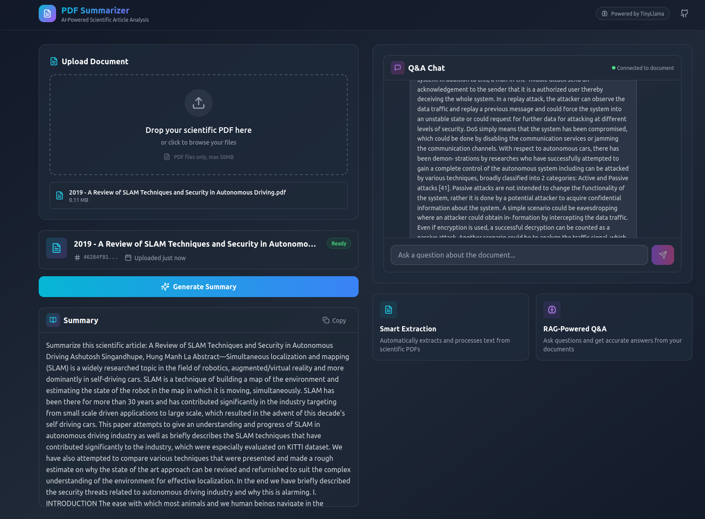

# PDF Summarizer - AI-Powered Scientific Article Analysis

A full-stack application that summarizes PDF scientific articles with interactive Q&A capabilities. Built with Django (backend), React (frontend), and LangChain with Google Gemini AI for processing.





## Features

- 📄 **PDF Upload & Text Extraction** - Upload scientific PDFs and automatically extract text using PyMuPDF
- 🤖 **AI-Powered Summarization** - Generate concise summaries using Google Gemini AI
- 💬 **Interactive Q&A** - Ask questions about your documents with RAG (Retrieval Augmented Generation)
- 🔍 **Vector Search** - FAISS-powered semantic search with Gemini embeddings for accurate answers
- 🎨 **Modern UI** - Beautiful React frontend with Tailwind CSS and dark theme

## Architecture

```
┌─────────────────┐     ┌─────────────────┐     ┌─────────────────┐
│                 │     │                 │     │                 │
│  React Frontend │────▶│  Django Backend │────▶│  Google Gemini  │
│   (Vite + TW)   │     │   (REST API)    │     │       AI        │
│                 │     │                 │     │                 │
└─────────────────┘     └────────┬────────┘     └─────────────────┘
                                 │
                                 ▼
                        ┌─────────────────┐
                        │   FAISS Vector  │
                        │      Store      │
                        │  (Gemini Emb.)  │
                        └─────────────────┘
```

### How RAG Works

1. **Document Processing**: PDF text is split into chunks and embedded using Gemini embeddings
2. **Vector Storage**: Chunks are stored in FAISS for fast similarity search
3. **Query Processing**: User questions trigger similarity search to find relevant chunks
4. **Answer Generation**: Relevant context + question are sent to Gemini for accurate answers

## Prerequisites

- Python 3.11+
- Node.js 18+
- npm or yarn

## Project Structure

```
django-react-pdf-summarizer/
├── backend/
│   ├── core/                 # Main Django app
│   │   ├── models.py         # Document model
│   │   ├── views.py          # API endpoints
│   │   ├── services.py       # LLM & Vector store logic
│   │   ├── serializers.py    # DRF serializers
│   │   └── urls.py           # URL routing
│   ├── pdf_summarizer/       # Django project settings
│   └── manage.py
├── frontend/
│   ├── src/
│   │   ├── components/       # React components
│   │   │   ├── ChatInterface.jsx
│   │   │   ├── DocumentInfo.jsx
│   │   │   ├── FileUploader.jsx
│   │   │   └── SummaryPanel.jsx
│   │   ├── services/         # API service
│   │   ├── App.jsx           # Main app component
│   │   └── main.jsx          # Entry point
│   └── package.json
└── README.md
```

## Installation & Setup

### 1. Clone the Repository

```bash
git clone <repository-url>
cd django-react-pdf-summarizer
```

### 2. Backend Setup

```bash
# Navigate to backend
cd backend

# Create virtual environment (if not exists)
python -m venv ../pdfsummarizervenv

# Activate virtual environment
# Linux/macOS:
source ../pdfsummarizervenv/bin/activate
# Windows:
# ..\pdfsummarizervenv\Scripts\activate

# Install Python dependencies
pip install django djangorestframework django-cors-headers
pip install langchain langchain-community langchain-text-splitters langchain-google-genai
pip install faiss-cpu
pip install pymupdf python-dotenv

# Run migrations
python manage.py migrate

# Create media directory for uploads
mkdir -p media/pdfs
```

### 3. Frontend Setup

```bash
# Navigate to frontend
cd ../frontend

# Install dependencies
npm install

# Create environment file (optional)
cp .env.example .env
```

## Running the Application

### Start Backend Server

```bash
# From the backend directory
cd backend
source ../pdfsummarizervenv/bin/activate  # Linux/macOS
python manage.py runserver
```

The backend API will be available at: `http://localhost:8000`

### Start Frontend Development Server

```bash
# From the frontend directory (in a new terminal)
cd frontend
npm run dev
```

The frontend will be available at: `http://localhost:5173`

## API Endpoints

| Method | Endpoint | Description |
|--------|----------|-------------|
| POST | `/core/upload/` | Upload a PDF file |
| POST | `/core/summarize/` | Generate summary for a document |
| POST | `/core/query/` | Ask a question about a document |

### API Usage Examples

**Upload PDF:**
```bash
curl -X POST http://localhost:8000/core/upload/ \
  -F "file=@your-paper.pdf"
```

**Generate Summary:**
```bash
curl -X POST http://localhost:8000/core/summarize/ \
  -H "Content-Type: application/json" \
  -d '{"doc_id": "your-document-uuid"}'
```

**Query Document:**
```bash
curl -X POST http://localhost:8000/core/query/ \
  -H "Content-Type: application/json" \
  -d '{"doc_id": "your-document-uuid", "query": "What are the main findings?"}'
```

## Configuration

### Backend Configuration

Edit `backend/pdf_summarizer/settings.py`:

```python
# CORS settings - add your frontend URL
CORS_ALLOWED_ORIGINS = [
    "http://localhost:3000",
    "http://localhost:5173",
]
```

### Frontend Configuration

Create `frontend/.env`:

```env
VITE_API_URL=http://localhost:8000/core
```

## Technology Stack

### Backend
- **Django 5.2** - Web framework
- **Django REST Framework** - API development
- **LangChain** - LLM orchestration
- **Google Gemini AI** - LLM for summarization and Q&A (gemini-3-flash-preview)
- **Gemini Embeddings** - Text embeddings (gemini-embedding-001)
- **FAISS** - Vector similarity search
- **PyMuPDF** - PDF text extraction

### Frontend
- **React 18** - UI library
- **Vite** - Build tool
- **Tailwind CSS** - Styling
- **Axios** - HTTP client
- **React Dropzone** - File upload
- **React Markdown** - Markdown rendering
- **Lucide React** - Icons

## Environment Variables

Create a `.env` file in the `backend/` directory:

```env
GEMINI_API_KEY=your-google-gemini-api-key
```

Get your API key from [Google AI Studio](https://aistudio.google.com/app/apikey).

## Troubleshooting

### Common Issues

**1. CORS Error**
```
Make sure django-cors-headers is installed and configured:
pip install django-cors-headers
```

**2. Gemini API Key Missing**
Ensure you have set your `GEMINI_API_KEY` in the backend `.env` file or Django settings.

**3. API Rate Limits**
Google Gemini has rate limits on the free tier. If you hit limits, wait a moment and retry.

**4. PDF Upload Fails**
Ensure the media directory exists:
```bash
mkdir -p backend/media/pdfs
```

**5. JSON in Response**
If you see raw JSON with `type`, `text`, `signature` fields, ensure you're using the latest frontend code that properly extracts text content from Gemini responses.

## Development

### Running Tests

```bash
# Backend tests
cd backend
python manage.py test

# Frontend (if tests are configured)
cd frontend
npm test
```

### Building for Production

```bash
# Frontend build
cd frontend
npm run build
```

## License

MIT License - see LICENSE file for details.

## Contributing

1. Fork the repository
2. Create a feature branch
3. Make your changes
4. Submit a pull request

---

**Note:** This project uses Google Gemini AI (gemini-3-flash-preview) which provides high-quality responses with fast inference. You can switch to other Gemini models like `gemini-pro` or `gemma-3-27b-it` by modifying the model name in `backend/core/services.py`.